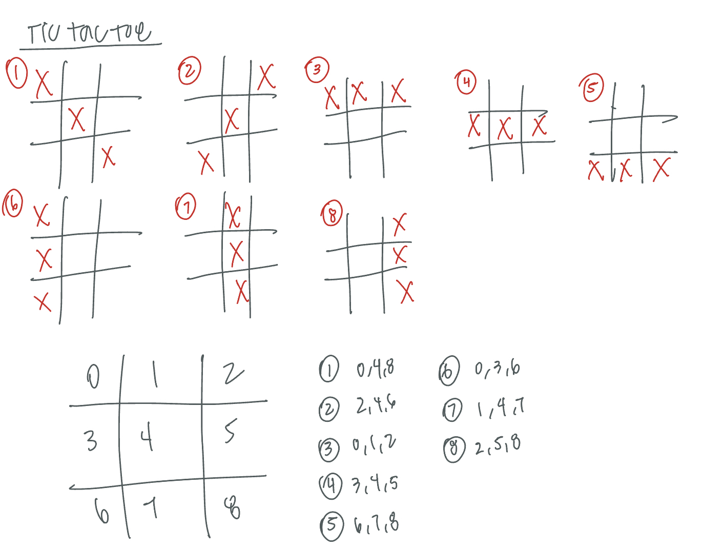
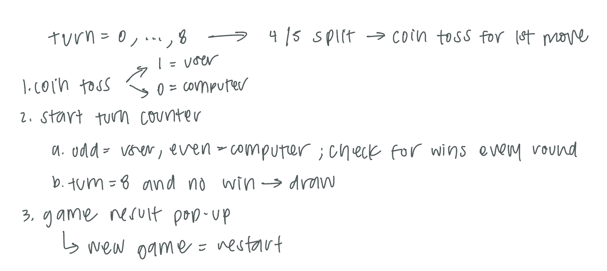
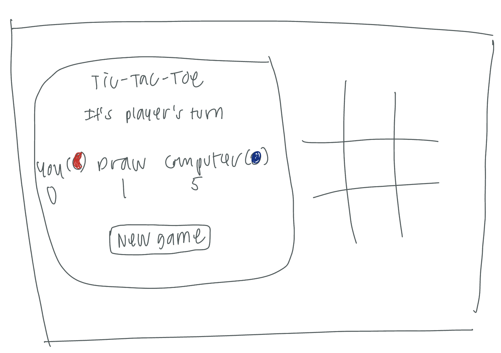

# Tic-Tac-Toe 

## Project Description

This project is a Tic-Tac-Toe web application where the user can play against a computer. It is written with the basics: HTML, JS, and CSS. 

## How It Works/Feature Breakdown

0. Board Set Up (newGame(), updateVisualBoard())

The game is dependent on 2 different boards: the virtualBoard and visualBoard.
virtualBoard - an array that has spaces for 9 boxes (AKA the 9 squares for tic tac toe)
visualBoard - a list of the DOM elements that represent the tic tac toe board that users can interact with
The visualBoard will be updated as the virtualBoard is updated based on user input.

1. Coin Toss (userStarts())

The beginning move in the game will be determined by a coin toss.
1 - user starts
0 - computer starts

2. Take Turns to Play AKA Tic-Tac-Toe (play(e), computerPlay())

If the user starts, the app will wait for the user to click on a square that they want to mark. If the computer starts, the app will generate a random number then mark that square if it is not already marked. At each turn, the virtualBoard and visualBoard are updated and the board is checked to see if there are any wins.

3. Winning Conditions (checkWin())

At each turn, there are 8 winning conditions (main.js > winningConditions) and a draw possibility. We will check all of these and know there is a win on the board if the board is filled on the correct spots with the same mark.

4. Results (animation(idx))

When there is a win from the user/computer or a draw, an animation will highlight the board squares that have the win or the entire board for a draw. The appropriate score will be updated.

5. Board Clean Up + Set Up (pointerEvents(enable))

The game ends and no further moves are allowed, so all pointer events are disabled. Additionally, user pointer events are disabled/enabled at certain points in the game, such as when it is the computer's turn to play or when the app is checking for a win.
There is an option to start the game again and it will keep the score until the browser is reloaded.

## Approach

First, I played a few games of tic tac toe to remind myself of the game rules and requirements I would need for the web app. This way, I found that there were 8 winning conditions and a possibility for a draw.
  
 

Then I started listing the main features that would be necessary for a game of tic-tac-toe.

 

Then I drafted a sketch of what I wanted the web app to look like. This is the final iteration:

 

I completed the HTML and some basic CSS before attacking the JS, which would get us all the functionalities for the web app. 

## Challenges

### Implementation: How to keep track of marks
It was one thing to make a function with an 'onclick' functionality, however it was another thing to be able to keep track of the board marks. At first I tried to just pull the HTML from the DOM elements, however I found it a waste of time to continuously do this since I would need to do this many times. After staring at the tic tac toe winning conditions, I realized I could utilize a 1-d array that would represent the board. This helped immensely in terms of readability and I just had to write a function that would translate the 1-d array to the DOM, which was updateVisualBoard().

### Bug: User clicking too fast would mark the board incorrectly
After getting the user play(e) and computerPlay() functions, I was testing to see if there were any bugs and saw that if the user clicked on another empty square too quickly when it was the computer's turn, it would register that click and thus incorrectly mark the board. I knew to fix it with enabling and disabling pointer events at specific times, however it took time to find those specific times. I debugged by using console.log and following the print statements to see which function it would lead to or end up at. I was able to find the sweet spots eventually.

### CSS Troubles Pt. 1: Aesthetics?
It was difficult deciding what I wanted the web app to look like because it would only have a title, status of who's turn it was, and the actual board. After messing around with some colors and trying to think of how to make it stand out, I had the idea of making it Candy Crush themed. Thus, after finessing with the CSS for 2 hours, everything worked out.

### CSS Troubles Pt. 2: How to Center a Div
To be honest, I had lost my touch with the basics of CSS Flexboxes. I had a quick refresher using this resource: https://demo.agektmr.com/flexbox/ . It was smooth sailing afterwards.

## Resources
1. Candy Crush Background Image - https://www.wallpaperflare.com/video-game-candy-crush-soda-saga-wallpaper-stric/download
2. Candy Crush Candy Blue and Red Candy Images - https://candycrush.fandom.com/wiki/Candies 
3. MDN Web Docs - https://developer.mozilla.org/en-US/
4. Google Fonts - https://developers.google.com/fonts/docs/getting_started, https://fonts.google.com/specimen/Oleo+Script
5. Animation CodePen - https://codepen.io/Jtwa/pen/dYvLpN
6. How to deploy Heroku app - https://medium.com/@winnieliang/how-to-run-a-simple-html-css-javascript-application-on-heroku-4e664c541b0b
